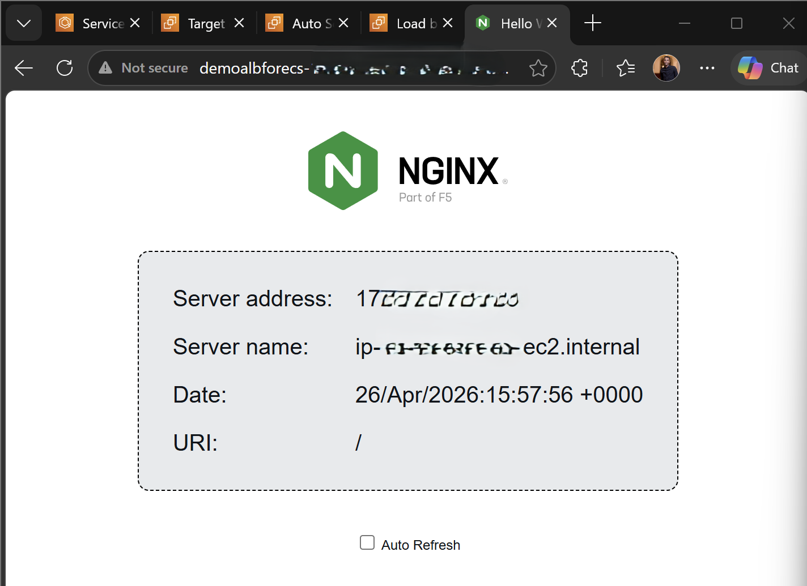
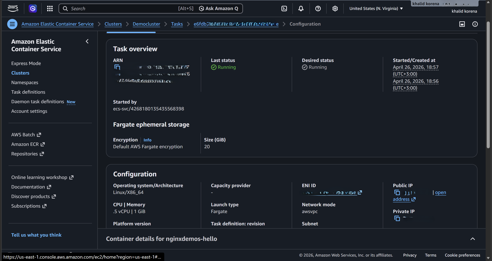
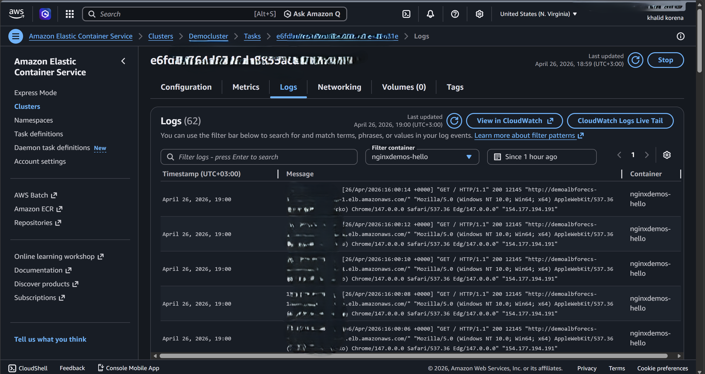

# Scalable Nginx Web Service on AWS ECS (Fargate)

## 📌 Project Overview
This project demonstrates a production-ready, **containerized** web service architecture on AWS. It leverages **Amazon ECS** with **AWS Fargate** to achieve a completely **Serverless** container orchestration, ensuring high availability, scalability, and robust monitoring.

---

## 🏗️ Architecture Components

### 1. Containerization & Orchestration
* **Docker:** The application is containerized using Nginx to ensure environment consistency.
* **Amazon ECS:** Used for managing the lifecycle of containers (Tasks and Services).
* **AWS Fargate:** Employed as the compute engine to run containers without managing underlying EC2 instances (Serverless).

### 2. High Availability & Networking
* **Application Load Balancer (ALB):** Acts as the entry point, distributing traffic across multiple tasks in different Availability Zones.
* **Target Groups:** Configured to monitor the health of each container.

### 3. Scalability & Elasticity
* **Service Auto Scaling:** Configured to dynamically adjust the task count based on demand, optimizing both performance and cost.

### 4. Observability & Monitoring
* **CloudWatch Logs:** Integrated to capture real-time application logs for troubleshooting.
* **Health Metrics:** Continuous monitoring of container status (Healthy/Unhealthy).

---

## 📸 Implementation Gallery

### 1. Web Service Live Demo

### 2. ECS Service & Task Status

### 3. Monitoring & Logs (CloudWatch)

---

## 🚀 Skills Demonstrated
* AWS Cloud Infrastructure (ECS, Fargate, ALB).
* Containerization (Docker).
* High Availability & Load Balancing.
* Cloud Monitoring & Observability.
